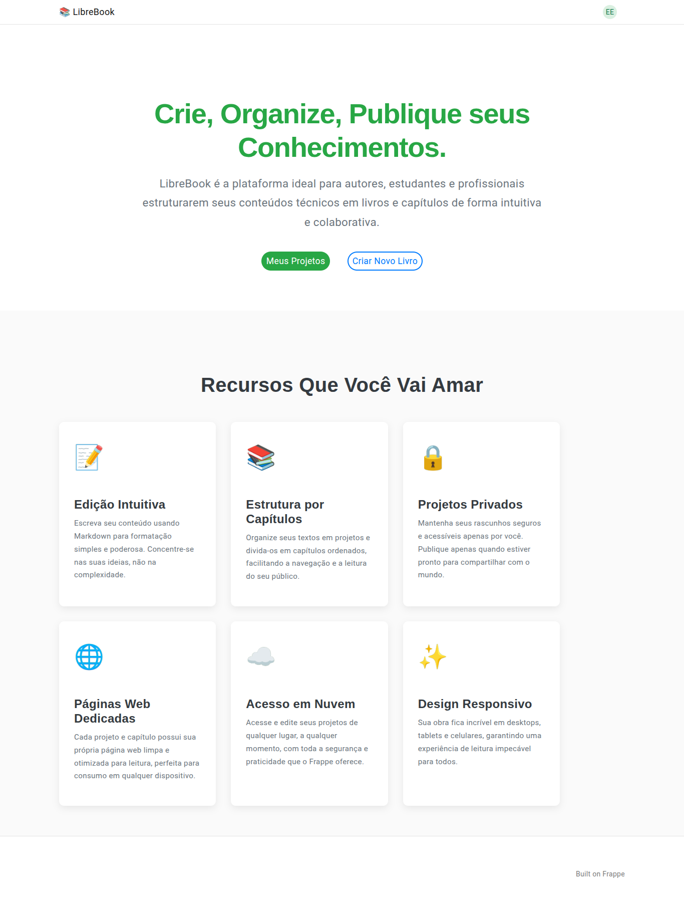
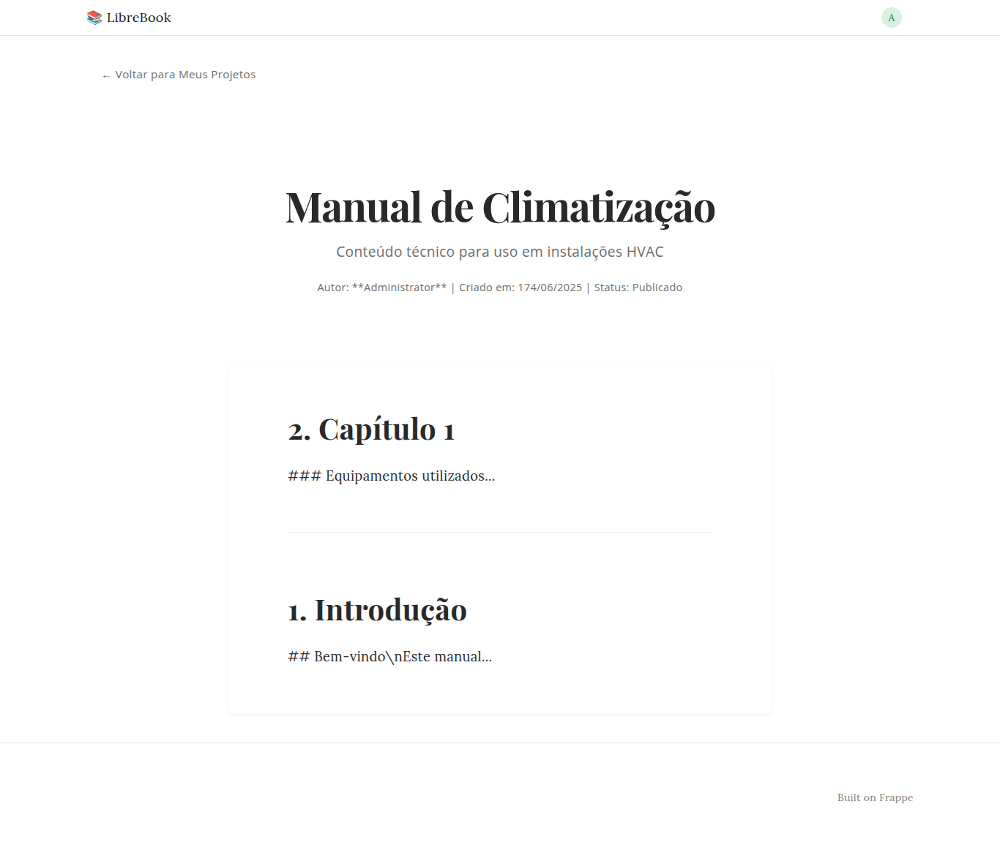
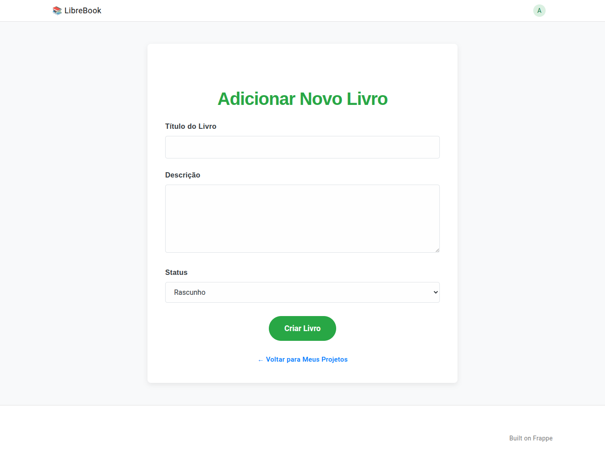
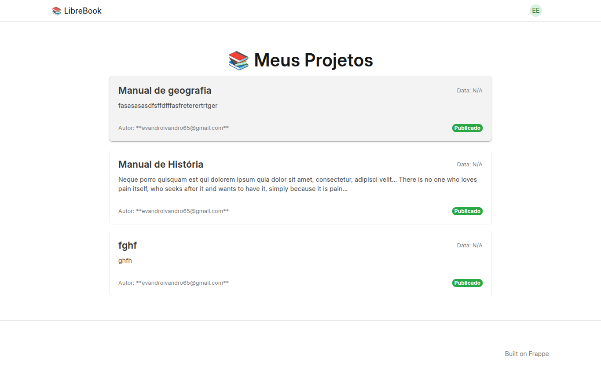

# 📚 LibreBookChallenge: Plataforma de Organização e Edição de Conteúdo Técnico

## 🚀 Visão Geral

LibreBook é uma aplicação web desenvolvida com o **Frappe Framework** que oferece uma plataforma intuitiva para organizar, criar e editar conteúdos técnicos estruturados em capítulos. Nosso foco foi em modelar dados de forma eficiente, aproveitar os recursos robustos do Frappe para uma aplicação funcional e proporcionar uma experiência de usuário limpa e agradável através de um layout personalizado.

## ✨ Funcionalidades Implementadas

A plataforma LibreBook oferece as seguintes capacidades para seus usuários:

* **Autenticação e Login**: Utiliza o sistema de autenticação padrão do Frappe para acesso seguro.
* **Gestão de Projetos**: Os usuários podem listar, visualizar e gerenciar todos os seus `BookProject`s.
* **Visualização Detalhada**: Cada `BookProject` pode ser visualizado em detalhes, exibindo todos os capítulos associados.
* **Visualização Protegida do Livro**: Páginas dedicadas para uma visualização limpa e focada do conteúdo completo do livro, com controle de acesso conforme o status do projeto.
* **Controle de Acesso por Usuário**: Garantia de que cada usuário só pode acessar e gerenciar seus próprios `BookProject`s e `BookChapter`s.

## 📁 Estrutura de Dados (DocTypes)

A arquitetura de dados do LibreBook é centrada em dois DocTypes principais:

* **BookProject**: Representa um livro ou projeto de documentação.
    * `Título`: Nome principal do projeto.
    * `Descrição`: Detalhes sobre o conteúdo do projeto.
    * `Data de criação`: Timestamp da criação do projeto.
    * `Autor`: Usuário Frappe que criou o projeto (automaticamente definido pelo usuário logado).
    * `Status`: Define o estado atual do projeto (ex: `Rascunho`, `Publicado`).

* **BookChapter**: Representa um capítulo individual dentro de um `BookProject`.
    * `Referência ao projeto` (`BookProject`): Um campo de link para o `BookProject` ao qual este capítulo pertence.
    * `Título do capítulo`: Nome do capítulo.
    * `Ordem`: Número ou índice para definir a sequência dos capítulos dentro do livro.
    * `Conteúdo`: O texto completo do capítulo

## 🎨 Design e Layout Personalizado

* **CSS Próprio**: Utilizamos arquivos `.css` personalizados e estilos em templates Jinja para ir além do visual padrão do Frappe Desk.

## 🔗 API REST para Integração Externa

LibreBook expõe uma API REST robusta e segura para permitir que ferramentas externas acessem os dados completos de um projeto.

* **Endpoint**: `/api/method/libre.api.get_full_book`
* **Método**: `GET`
* **Parâmetro de Consulta**: `project_name` (o nome do `BookProject` desejado)
* **Formato de Retorno**: JSON contendo os detalhes do projeto e uma lista completa de seus capítulos.

    ```json
    {
      "project": {
        "title": "Manual de Climatização",
        "description": "Conteúdo técnico para uso em instalações HVAC",
        "author": "joao@example.com",
        "created_at": "2025-06-20",
        "status": "Publicado"
      },
      "chapters": [
        {
          "order": 1,
          "title": "Introdução",
          "content_markdown": "## Bem-vindo\nEste manual..."
        },
        {
          "order": 2,
          "title": "Capítulo 1",
          "content_markdown": "### Equipamentos utilizados..."
        }
      ]
    }
    ```

* **Autenticação**: A API requer **token de autenticação Frappe** para acesso seguro.
* **Controle de Acesso**: Cada token de usuário só pode acessar os projetos de sua autoria, garantindo a privacidade dos dados.

## 🛠️ Tecnologias Utilizadas

* **Framework**: Frappe Framework (v13+ ou v14)
* **Frontend**: Jinja (Web Templates), Web Views
* **CSS**: Customizado manualmente
* **Banco de Dados**: MariaDB (padrão do Frappe)

## 📦 Como Instalar e Testar Localmente

✅ 1. Requisitos
Antes de tudo, certifique-se de que tem:
Python 3.10+
Node.js (>= 16)
Yarn
Redis
MariaDB
Git

pode acessar este link para os pré-requisitos: https://docs.frappe.io/framework/user/en/installation 

Siga os passos abaixo para configurar e executar o LibreBook em seu ambiente local:

1.  **Pré-requisitos**: Certifique-se de ter o `bench` do Frappe Framework configurado.
2.  **Clonar o Repositório**:
    ```bash
    git clone https://github.com/EvandroEusebio/LibreBookChallenge.git 
    cd LibreBookChallenge/librebook
    ```
3.  **Configurar o Bench (se ainda não o fez)**:
    ```bash
    bench init frappe-bench
    cd frappe-bench
    bench new-app libre # Se o seu app não for 'libre'
    ```
4.  **Adicionar o Aplicativo ao Bench**:
    ```bash
    bench get-app libre <URL_DO_SEU_REPOSITORIO>
    ```
    *(Se você já clonou o app manualmente, use `bench get-app --no-pull libre ../librebook_app`)*
5.  **Criar um Novo Site Frappe (ou usar um existente)**:
    ```bash
    bench new-site book.site
    ```
6.  **Instalar o Aplicativo no Site**:
    ```bash
    bench --site book.site install-app libre
    ```
7.  **Sincronizar DocTypes e Migrar Banco de Dados**:
    ```bash
    bench --site book.site migrate
    ```
8.  **Iniciar o Servidor de Desenvolvimento**:
    ```bash
    bench start
    ```
    Acesse a aplicação em `http://book.site:8080` (ou a porta que o `bench start` indicar).

## 📸 Demonstração

* **Captura de Tela 1**: Página inicial

* **Captura de Tela 2**: Visualização de um projeto e seus capítulos.

* **Captura de Tela 3**: Formulário de adição/edição de capítulo com Markdown.

* **Captura de Tela 2**: Visualização de um projeto


## 🤝 OBRIGADO